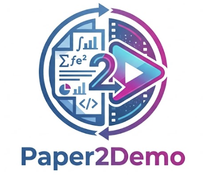

<div align="center">
<p align="center">
  
</p>


## Paper2Demo: Turn any academic PDF into a stunning demo video — fully automatically.

*Drop in a research paper. Walk away with a production-quality video presentation.*

[](LICENSE) [](https://python.org) [](https://remotion.dev) [](https://platform.deepseek.com)

> ⚠️ **Early version** — This is a v0 prototype. Expect rough edges. Contributions and feedback are very welcome.

</div>

---

## 🔧 How It Works

<div align="left">
  
  <br>
  <em> <strong>The overall architecture of the Paper2Demo pipeline.</strong>The system transforms a raw PDF into a dynamic video via three main modules: local spatial extraction (extractor.py), AI-driven semantic structuring and summarization (analyzer.py), and dynamic video rendering with spring-physics animations (Remotion)</em>
</div>
<br>

---

## 🎥 Demo

*OBS-Diff: Accurate Pruning for Diffusion Models in One-Shot*

<div align="center">
  <video src="https://github.com/user-attachments/assets/OBS-DIFF--ACCURATE-PRUNING-FOR-DIFFUSION.mp4" width="80%" controls="controls" muted="muted" autoplay="autoplay"></video>
  <br>
  <em>A real video abstract generated entirely by Paper2Demo.</em>
</div>

---

## ✨ What it does

Given a PDF like this:

```
Attention Is All You Need (Vaswani et al., NeurIPS 2017)
```

It produces a ~30-second animated video with:

- **Title scene** — paper title, authors, venue, adaptive color theme
- **Problem scene** — the challenge the paper addresses, with animated bullet cards
- **Method scene** — pipeline diagram + the paper's own architecture figure
- **Contributions scene** — key contributions in a clean grid layout
- **Results scene** — quantitative stats + the paper's results figure

Every video is **automatically themed** based on the paper's domain — blue for efficiency/compression, purple for generative models, teal for NLP, orange for RL, and more.

---

## 🚀 Quick Start

### 1. Clone and install

```bash
git clone https://github.com/yourusername/paper2demo
cd paper2demo

# Remotion (video renderer)
npm install

# Python pipeline
cd paper2demo
pip install -r requirements.txt
```

### 2. Get an API key

[DeepSeek](https://platform.deepseek.com) is recommended — cheap, fast, and works globally.
Analyzing a full paper costs roughly **$0.01**.

```bash
export DEEPSEEK_API_KEY=sk-...

# Or use Google Gemini
export GEMINI_API_KEY=AIza...
```

### 3. Run

```bash
cd paper2demo
python main.py /path/to/paper.pdf
```

### 4. Preview

```bash
cd ..
npm run dev
# Open http://localhost:3000 → select PaperDemo
```

### 5. Export

```bash
npx remotion render PaperDemo
```

That's it. One command, one video.

---


## 🎨 Adaptive Themes

The AI detects the paper's domain and applies a matching color theme automatically.

| Domain | Theme | Palette |
|--------|-------|---------|
| Model Compression / Pruning | **efficiency** | Blue · Purple |
| Image Generation / Diffusion | **creative** | Purple · Pink |
| NLP / Large Language Models | **language** | Teal · Green |
| Reinforcement Learning | **action** | Orange · Amber |
| Computer Vision | **vision** | Sky Blue · Indigo |
| Multimodal (Vision-Language) | **fusion** | Cyan · Magenta |
| Robotics | **robotics** | Steel · Orange |
| Medical / Bioinformatics | **medical** | Blue · Aqua |
| Theory / Optimization | **academic** | Gold · Purple |
| Systems / Infrastructure | **systems** | Emerald · Blue |

---

## 📁 Project Structure

```
paper2demo/              Python pipeline
├── main.py              CLI entry point
├── extractor.py         PDF parsing — text + figures (PyMuPDF)
├── analyzer.py          AI analysis → paper-data.json
└── requirements.txt

src/PaperDemo/           Remotion video composition
├── index.tsx            Main composition + calculateMetadata
├── types.ts             TypeScript types for paper-data.json
├── shared.tsx           Reusable animation hooks + components
└── scenes/
    ├── TitleScene.tsx
    ├── ProblemScene.tsx
    ├── MethodScene.tsx          ← embeds extracted figure
    ├── ContributionsScene.tsx
    └── ResultsScene.tsx         ← embeds extracted figure

public/paper/            Auto-generated (gitignored)
├── paper-data.json
└── fig_*.png
```

---

## ⚙️ CLI Options

```bash
python main.py paper.pdf [--provider deepseek|gemini] [--output /path/to/project]
```

| Flag | Default | Description |
|------|---------|-------------|
| `--provider` | `deepseek` | AI provider (`deepseek` or `gemini`) |
| `--output` | parent of `paper2demo/` | Remotion project root |

---

## 💡 Tips

**Cost** — A full 22-page paper costs ~$0.01 with DeepSeek. The chunked pipeline makes even 100-page papers affordable.

**Figure quality** — Figures are extracted at full resolution from the PDF. The AI matches each figure to the right scene by reading caption text, not by guessing filenames.

**Speed** — Extraction is instant (local). Analysis takes 30–60 seconds depending on paper length and provider. Rendering takes ~2 minutes on a modern laptop.

---

## 🗺️ TODO List

- [ ] Direct arXiv URL input (`python main.py arxiv:2312.00752`)
- [ ] Multiple video templates (minimal white, magazine, cinematic)
- [ ] AI-generated voiceover via ElevenLabs
- [ ] Batch processing for reading lists
- [ ] Auto-generate animated charts from paper tables
- [ ] Web UI — drag and drop, no terminal needed

---

## 🤝 Contributing

PRs are welcome. If you make a video from a cool paper, share it and tag the repo.

---

